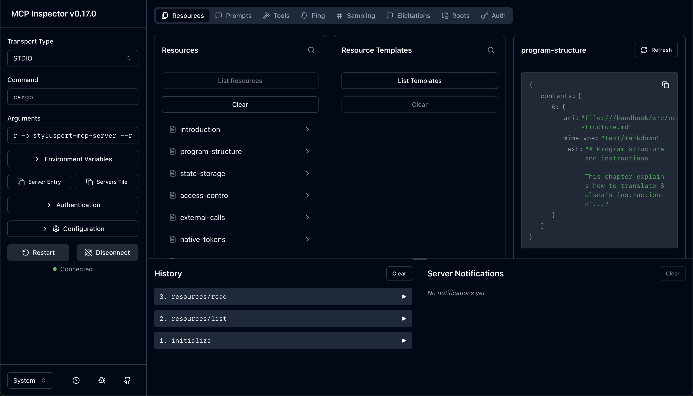
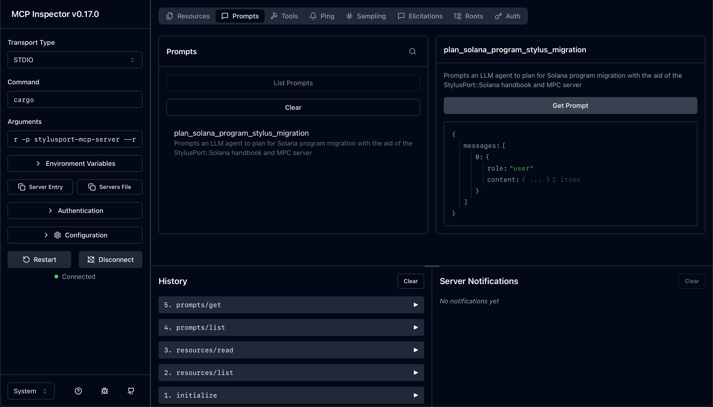
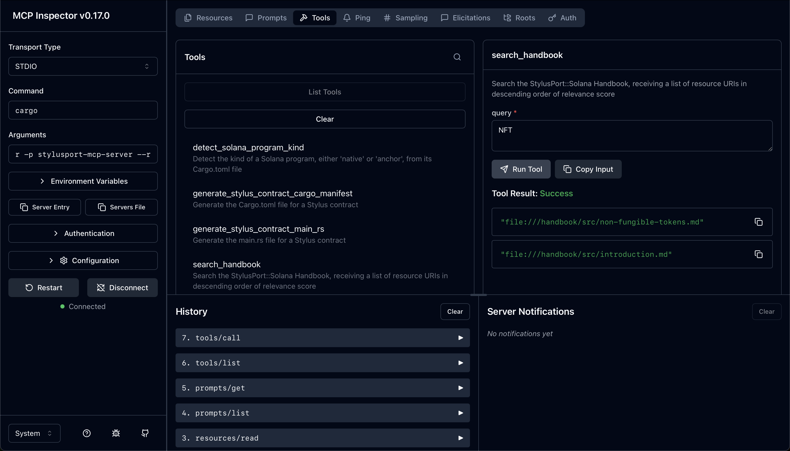

# StylusPort::Solana MCP Server

An MCP (Model Context Protocol) server for migrating Solana programs to Stylus contracts on Arbitrum. Provides tools, resources, and prompts to assist LLM agents in planning and executing migrations.


> Note: the `--dangerously-skip-permissions` flag is used above only for demonstation purposes and is not recommended during regular usage.

## Overview

This server exposes:
- **Tools**: Detect Solana program types, generate Stylus boilerplate, search migration handbook
- **Resources**: Handbook chapters covering migration patterns and case studies
- **Prompts**: Guided migration planning workflow

## Installation

Install from GitHub:
```bash
cargo install stylusport-mcp-server --git https://github.com/oak-security/stylusport --tag v1.0.0 --locked
```

### Using with LLM Tools

This MCP server works with any tool that supports stdio-based MCP servers. For installation instructions:

- [**Claude Code**](https://docs.claude.com/en/docs/claude-code/mcp#option-3%3A-add-a-local-stdio-server)
  ```bash
  claude mcp add --transport stdio stylusport stylusport-mcp-server
  ```

- [**Cursor**](https://cursor.com/docs/context/mcp#using-mcpjson)
  ```json
  {
    "mcpServers": {
      "stylusport": {
        "command": "stylusport-mcp-server",
      }
    }
  }
  ```

- [**Zed**](https://zed.dev/docs/ai/mcp#as-custom-servers)
  ```json
  {
    "context_servers": {
      "stylusport": {
        "source": "custom",
        "command": "stylusport-mcp-server",
      }
    }
  }
  ```

- [**GitHub Copilot**](https://docs.github.com/en/copilot/how-tos/provide-context/use-mcp/extend-copilot-chat-with-mcp#configuring-mcp-servers-manually)

## Configuration

### Environment Variables

The following environment variables can be used to customize the server:

- `STYLUSPORT_N_WORKERS` - Number of worker threads for request handling (default: 4)
- `STYLUSPORT_MCP_ALLOY_PRIMITIVES_VERSION` - Version spec for alloy-primitives dependency (default: "=0.8.14")
- `STYLUSPORT_MCP_ALLOY_SOL_TYPES_VERSION` - Version spec for alloy-sol-types dependency (default: "=0.8.14")
- `STYLUSPORT_MCP_OPENZEPPELIN_STYLUS_VERSION` - Version spec for openzeppelin-stylus dependency (default: "=0.2.2")
- `STYLUSPORT_MCP_STYLUS_SDK_VERSION` - Version spec for stylus-sdk dependency (default: "=0.9.0")
- `STYLUSPORT_MCP_ARBITRARY_VERSION` - Version spec for arbitrary dependency (default: "=1.4.2")
- `STYLUSPORT_MCP_MOTSU_VERSION` - Version spec for motsu dependency (default: "0.10.0")

## Architecture

- `src/main.rs` - Entry point and message dispatcher
- `src/server.rs` - Multi-threaded stdio-based MCP server implementation
- `src/handler.rs` - MCP request handlers (initialize, ping, list/read resources, etc.)
- `src/tools.rs` - Tool definitions and implementations
- `src/resources.rs` - Resrouce definigions (Handbook chapters) and search infrastructure
- `src/resources/bm25.rs` - BM25 ranking algorithm for resource search
- `src/prompts.rs` - Prompt definitions

## Tools

### `detect_solana_program_kind`
Analyzes a Cargo.toml to determine if a Solana program is "native" or "anchor" framework.

### `generate_stylus_contract_cargo_manifest`
Generates a Cargo.toml for a new Stylus contract with appropriate dependencies.

### `generate_stylus_contract_main_rs`
Generates the main.rs boilerplate for a Stylus contract.

### `search_handbook`
Searches the migration handbook using BM25 ranking, returning resource URIs in descending relevance order. The search implementation handles both prose and code tokens with identifier splitting for Rust-specific patterns.

## Resources

The server exposes 13 handbook chapters covering:
- Program structure comparison
- State storage patterns
- Access control migration
- External calls
- Token operations (native, fungible, non-fungible)
- Errors and events
- Testing and debugging
- Gas optimization
- Security considerations
- Complete case study (Bonafida token vesting)

All resources use `file://` URIs and markdown content.

## Prompts

### `plan_solana_program_stylus_migration`
Provides a structured workflow for analyzing a Solana program and creating a comprehensive migration plan. Guides the agent through codebase analysis, handbook consultation, design decisions, and phased implementation planning.

[Example Migration Plan](./docs/sample-plan-prompt-output-raydium-cp-swap.md) generated by Claude Code using the MCP Server on [Raydium's Constant-Product AMM](https://github.com/raydium-io/raydium-cp-swap).


## Development

Test:
```bash
cargo -p stylusport-mcp-server test
```

Inspect with MCP inspector:
```bash
npx @modelcontextprotocol/inspector cargo run -p stylusport-mcp-server --release
```

### Vendored Dependencies

The complete `stylusport-mcp-server` dependency tree sources are included & tracked in `vendor/` in order to reduce the supply chain attack surface as much as possible.

This directory can be updated by running:

```bash
cargo vendor ./vendor
```

It is important to keep the dependecy tree as small as possible. The only direct depedencies are:

- `rust-mcp-schema` - MCP protocol types (in turn only depends on serde/serde-json)
- `serde_json` - JSON serialization

### Inspector Screenshots

**Resources**



**Prompts**



**Tools**



